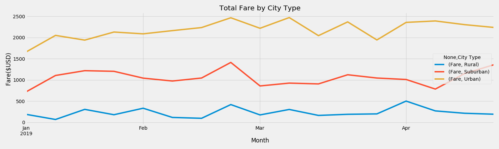

# PyBer_Analysis

The graph shows the total fare by City type, which in respect by Rural, Suburban and Urban. Each of the line has relatively consistent trend. There are occationally ups and downs,but there are no indicators to illustrate the reasoning behind it. 

Summary Table
Urban area has more riders among others due to the density of the area, which in result of higher demand of drivers and shorter trip per ride. On the contrary, Rural has the least drivers and highest fare per ride. In summary, Urban rides make up the majority of Pyber's revenue.

Implication
Pyber can continue to focus on the Urban market and promte to attract more riders to use Pyber service. Even Rural and Suburban areas may not generate a lot of revenue to the business, but it still plays an important role to overall profolio.

Challenges
Overall customers satisfation per ride should be taken into consideration. More detail data cold be collected to help Pyber comany to understand the different time slot(morning, afternoon or night) demand of the each area, which can provide better resource allocation and service to cutomers.   
